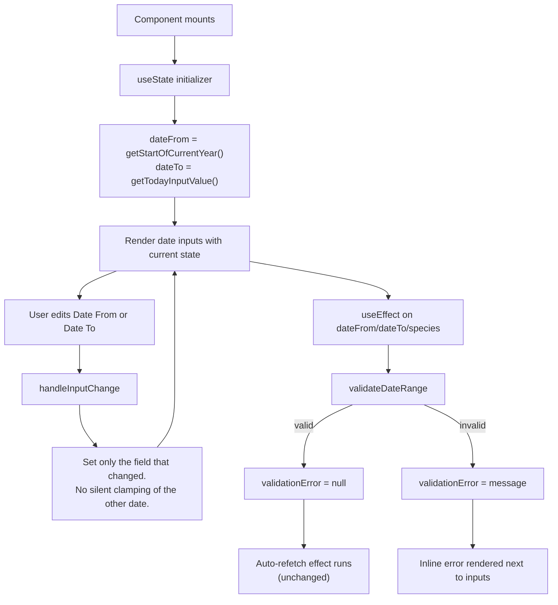

# Design Document

## Overview

This feature changes how the **Forecasting** admin page initializes and treats its two date inputs. The work is entirely client-side and contained within `src/app/admin/forecasting/page.tsx`. There are no API, database, or server-side changes.

Two behavioral shifts:

1. **New default range on mount.** `Date From` initializes to `January 1` of the current calendar year (instead of the first day of the month 12 months ago). `Date To` initializes to the user's local "today". Both values are formatted as `YYYY-MM-DD` for `<input type="date">`.
2. **Date To becomes truly user-editable.** The current `handleInputChange` silently mutates `dateTo` whenever `dateFrom` changes (and vice versa) to keep the pair inside a rolling 12-month window, and the markup pins `Date To` with `max={today}`. Combined, this makes `Date To` feel disabled. The new design strips the silent mutations and the native ceiling, and relies exclusively on the existing `validateDateRange` function to surface any out-of-range pair as an inline error.

The 12-month inclusive cap, the error copy, the `/api/distributions-data` request shape, and the rest of the page (filters, charts, layout, observations panel) are untouched.

## Architecture

- **Layer affected:** Single React client component, `HarvestForecast` in `src/app/admin/forecasting/page.tsx`.
- **Layers untouched:** API routes, server logic, persistence, navigation, other admin pages (notably `src/app/admin/reports/page.tsx`, which has its own date defaults and is explicitly out of scope).
- **State model:** `formData.dateFrom` and `formData.dateTo` remain plain strings inside the existing `useState<FormData>` hook. No new state, refs, contexts, hooks, or effects are introduced.
- **Storage:** No `localStorage`, cookies, URL params, or server state are added. Defaults are recomputed every time the component mounts, which automatically rolls forward when the calendar year changes.
- **Validation pipeline:** The existing `useEffect` that reruns `validateDateRange` on every `dateFrom` / `dateTo` / `species` change continues to be the single source of truth for inline validation. The downstream auto-refetch effect (which gates network calls on `validationError === null`) keeps working without modification.



## Components and Interfaces

### Affected component

- **`HarvestForecast`** (`src/app/admin/forecasting/page.tsx`): the only component changed.

### Helpers

The file already exports two relevant helpers in its module scope:

- `formatDateInputValue(date: Date): string` — emits `YYYY-MM-DD` from a `Date`. **Reused as-is.**
- `getTodayInputValue(): string` — returns `formatDateInputValue(new Date())`. **Reused as-is** as the source of `Today_Local`. (This is the function the requirements glossary calls "`getTodayLocal()`"; we keep its existing name to minimize churn.)

A new helper is added alongside them:

```ts
// Returns "YYYY-01-01" for the current calendar year, in local time.
const getStartOfCurrentYear = (): string => {
    const now = new Date();
    return `${now.getFullYear()}-01-01`;
};
```

The helper is intentionally minimal: it does not take parameters and does not depend on `formatDateInputValue`, because January 1 has fixed `MM` and `DD` segments.

The existing helper `getMinStartDateFor12MonthWindow(endDateInput: string): string` becomes **unused** for state initialization and `handleInputChange` clamping. It can either:

- Stay in the module as dead code (lowest-risk path; safe revert), or
- Be removed as part of implementation cleanup if no other callsite remains.

The decision is left to the task list. The behavioral design does not depend on which option is chosen.

### State initializer

The `useState<FormData>` initializer in `HarvestForecast` changes from the current shape:

```ts
const today = getTodayInputValue();
return {
    dateFrom: getMinStartDateFor12MonthWindow(today),
    dateTo: today,
    // ...other fields unchanged
};
```

to:

```ts
return {
    dateFrom: getStartOfCurrentYear(),
    dateTo: getTodayInputValue(),
    // ...other fields unchanged
};
```

This satisfies Requirements 1.1, 1.3, 1.5, 3.1. Requirement 1.2 (rolls forward each calendar year) is satisfied automatically because `getStartOfCurrentYear` reads the system clock on every mount. Requirement 3.2 (the "`Today_Local` < `Start_Of_Current_Year`" edge case) is left as a note in the test plan; under any sane local clock this pair is already valid because `Today_Local >= Start_Of_Current_Year` by construction, so no extra branching is added.

### `handleInputChange` for date fields

Today's logic for the two date fields runs four conditional clamps (the inner code paths under `if (field === 'dateTo')` and `if (field === 'dateFrom')`). The new logic collapses to:

```ts
const handleInputChange = (field: keyof FormData, value: string) => {
    setFormData(prev => {
        const newData = { ...prev, [field]: value };

        // Reset dependent dropdown fields when parent changes (unchanged).
        if (field === 'province') {
            newData.city = 'all';
            newData.barangay = 'all';
        } else if (field === 'city') {
            newData.barangay = 'all';
        }

        // No silent date clamping. Range correctness is enforced by
        // validateDateRange and surfaced as an inline error message.
        return newData;
    });
};
```

Concretely, **all four** of the following clamps that exist today are removed:

1. `if (field === 'dateTo')` → `newData.dateTo > today` ⇒ pull `dateTo` back to today.
2. `if (field === 'dateTo')` → `dateFrom < minStart` ⇒ push `dateFrom` forward.
3. `if (field === 'dateTo')` → `dateFrom > dateTo` ⇒ pull `dateFrom` back to `dateTo`.
4. `if (field === 'dateFrom')` → mirror set: clamp `dateFrom` to `minStart`, then bump `dateTo` to match `dateFrom`, then cap `dateTo` at today.

Removing clamp #4 is the core fix: editing `Date From` no longer mutates `Date To`. This satisfies Requirement 2.3. Removing clamp #3 ensures editing `Date To` no longer silently moves `Date From`. Clamps #1 and #2 are removed for symmetry: the same `validateDateRange` already covers both invalid cases, so the auto-mutation is duplicate work that hides errors instead of showing them. This satisfies Requirements 2.1, 2.2, 2.4.

### Date input markup

The two `<input type="date">` elements currently carry:

- **Date From:** `min={getMinStartDateFor12MonthWindow(formData.dateTo)}`, `max={formData.dateTo || getTodayInputValue()}`.
- **Date To:** `min={formData.dateFrom}`, `max={getTodayInputValue()}`.

Native `min` / `max` on `<input type="date">` constrain the picker UI itself: the user cannot scroll past those bounds, and typed-in values get rejected silently. That is the second half of why `Date To` "feels locked" — even after the handler clamps go away, `max={today}` on `Date To` would still gate the calendar picker.

To honor Requirement 2.2 ("allow selection of any date that satisfies `Date_Range_Validator`") and Requirement 5.5 ("keep both inputs editable while a validation message is displayed"), both inputs drop their `min` and `max` attributes:

```tsx
// Date From
<input
    type="date"
    value={formData.dateFrom}
    onChange={(e) => handleInputChange('dateFrom', e.target.value)}
    className="..."
/>

// Date To
<input
    type="date"
    value={formData.dateTo}
    onChange={(e) => handleInputChange('dateTo', e.target.value)}
    className="..."
/>
```

`disabled` and `readonly` are not present today and are not added. Other attributes (`className`, label, icon) are unchanged, satisfying Requirement 7.2.

### Validation surface

`validateDateRange` is preserved verbatim:

- Start later than end ⇒ `"Error: End date must be after start date."`
- Inclusive month span > 12 ⇒ `"Error: Date range cannot exceed 12 months. Current selection: {n} months."`

The `useEffect` that calls `validateDateRange` on every `[formData.dateFrom, formData.dateTo, formData.species]` change is preserved. This single hook covers:

- Live feedback on every keystroke / picker change (Requirements 4.1, 4.2, 4.3, 5.3, 5.4).
- Empty input handling: `new Date('')` is `Invalid Date`, comparisons against it are `false`, and the inclusive month math returns `NaN`. The validator's two checks evaluate to:
  - `endDate < startDate` → `false` for `NaN` comparisons, so it falls through.
  - `monthsDiff > 12` → `NaN > 12` is `false`, so it also falls through.
  - Result: the function returns `{ isValid: true }` for cleared inputs, which is **incorrect** for our gating purposes.

To honor Requirements 5.1 and 5.2 (cleared input must surface a validation message and gate the request) without changing the established error copy, the validator gains a single guard at the top:

```ts
if (!formData.dateFrom || !formData.dateTo) {
    return {
        isValid: false,
        errorMessage: 'Error: End date must be after start date.',
    };
}
```

We deliberately reuse the existing message rather than inventing a new "Please supply a date" string — Requirement 5.1/5.2 says "the standard date-range validation message", and 7.2 says copy and styling stay put. This keeps Requirements 4 and 5 covered with one error vocabulary.

The downstream auto-refetch `useEffect` already early-returns when `validationError` is non-null, so cleared inputs naturally short-circuit the network call (Requirements 5.1, 5.2 second clauses). Likewise, `generateForecastForCurrentFilters` short-circuits via the same `validateDateRange` guard before issuing a `Forecast_Request`.

## Data Models

No data model changes. The existing `FormData` interface is reused unchanged:

```ts
interface FormData {
    dateFrom: string;   // YYYY-MM-DD
    dateTo: string;     // YYYY-MM-DD
    species: string;
    province: string;
    city: string;
    barangay: string;
    facilityType: string;
}
```

The `/api/distributions-data` request payload (`startDate`, `endDate`, plus filters) and its response (`distributions[]`, etc.) are untouched, satisfying Requirement 7.1.

## Error Handling

| Scenario | Surfaced via | Request gated? |
| --- | --- | --- |
| Date From later than Date To | Inline message: `"Error: End date must be after start date."` | Yes |
| Range > 12 inclusive months | Inline message naming the current span | Yes |
| Date From or Date To cleared | Inline message: `"Error: End date must be after start date."` (reused per 5.1/5.2) | Yes |
| Network or API error after a valid forecast request | Existing `apiError` state and existing UI banner (unchanged) | n/a |
| Aborted in-flight request when filters change | Existing `AbortController` in `requestAbortRef` (unchanged) | n/a |

No new error states, banners, or toasts are introduced.

## Testing Strategy

### Why property-based testing does not apply

This feature is a UI default + a set of removed conditional branches. There is no parser, serializer, transform, algorithm, or general invariant whose correctness depends on covering a wide input space. The only pure helper added (`getStartOfCurrentYear`) returns a function of the system clock with no other inputs — there is nothing to "for all" over. Per the workflow's PBT-not-applicable rules (UI rendering, simple state, configuration-style defaults), the Correctness Properties section is intentionally omitted.

### Manual verification scenarios

The page does not currently ship with an automated test suite for this component, so verification is manual. All scenarios assume the dev server is running and the user has signed in as an admin. Each scenario lists the trigger, the expected `Date From` / `Date To` values, and the expected validation message (if any).

| # | Scenario | Trigger | Expected `Date From` | Expected `Date To` | Expected validation message |
| --- | --- | --- | --- | --- | --- |
| 1 | Fresh mount this year | Hard reload `/admin/forecasting` | `YYYY-01-01` for the current year | Today's local date | None |
| 2 | Year rollover | Mock the system clock to e.g. Jan 2 of next year, hard reload | `(Y+1)-01-01` | Same mocked `Today_Local` | None |
| 3 | Edit Date From within range | Change Date From to a date 3 months ago | New value | **Unchanged** from prior state | None |
| 4 | Edit Date From past Date To | Change Date From to tomorrow | New value | **Unchanged** | `"Error: End date must be after start date."` |
| 5 | Edit Date To freely | Change Date To to a date 2 weeks ahead of today | **Unchanged** | New value | None (assuming span ≤ 12 months) |
| 6 | Edit Date To far in the future | Set Date To to 13 months after Date From | **Unchanged** | New value | `"Error: Date range cannot exceed 12 months. Current selection: 14 months."` (or whatever inclusive span renders) |
| 7 | Clear Date From | Delete Date From content via the picker | Empty | Unchanged | `"Error: End date must be after start date."` |
| 8 | Clear Date To | Delete Date To content via the picker | Unchanged | Empty | `"Error: End date must be after start date."` |
| 9 | Restore from cleared | Re-enter a valid Date To while Date From holds a valid value | Unchanged | New value | Message clears |
| 10 | Generate gated by error | Trigger forecast generation while validation message is showing | n/a | n/a | No `/api/distributions-data` request issued; existing API-error or chart UI does not change |
| 11 | Persistence across filters | Change species / province / city / barangay after editing dates | Unchanged from user's edit | Unchanged from user's edit | None (assuming valid pair) |
| 12 | Reports page is unaffected | Open `/admin/reports` after exercising forecasting | n/a | n/a | The reports page's own date defaults render exactly as before this change |

### Network / DevTools checks

- During scenarios 4, 6, 7, 8, the Network panel should show **no** `/api/distributions-data` request issued from the date change.
- During scenario 5 with auto-refetch active (i.e. a forecast was already generated), the Network panel should show one debounced request with the new `endDate` query parameter.

### Out of scope for testing

- Unit tests for `getStartOfCurrentYear`, `formatDateInputValue`, `getTodayInputValue`, or `validateDateRange`. The page does not currently host any unit tests; introducing a Jest/Vitest harness for a defaults-only change is more invasive than the change itself. This is consistent with the requirements' "non-goals" framing.
- Integration tests against the API. The request shape is unchanged.
- Visual regression. The layout, copy, icons, and styling are unchanged (Requirement 7.2).

## Non-Goals (Reiterated)

The following are explicitly **not** part of this design:

1. No changes to forecast computation, `/api/distributions-data` request shape, or response handling.
2. No changes to the layout, labels, icons, or styling of the Forecasting Parameters panel beyond the two date inputs' default values and editability.
3. No changes to date-input behavior on any other page, including `src/app/admin/reports/page.tsx`.
4. No new persistent storage (`localStorage`, cookies, URL params, server-side state) for date values.
5. No expansion or contraction of the 12-month inclusive validation rule.
6. No new dependencies, hooks, contexts, or shared utilities beyond the local `getStartOfCurrentYear` helper.
